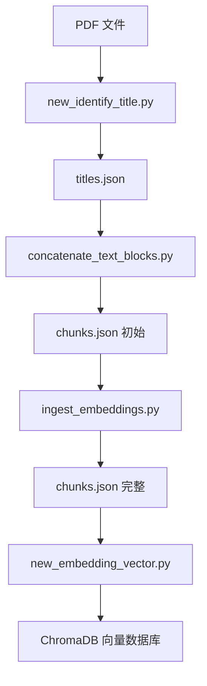
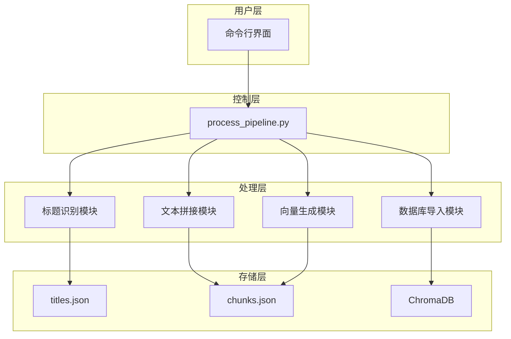
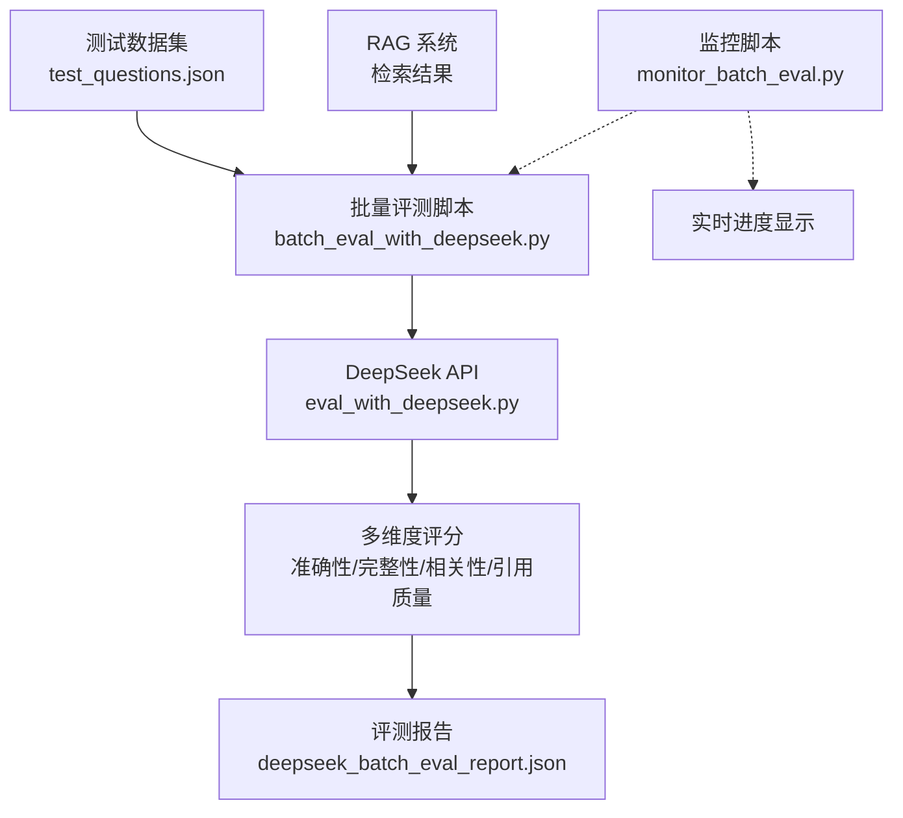

# 📚 PDF 处理流水线 - RAG 向量数据库构建工具

一键将 PDF 书籍转换为可语义检索的向量数据库，支持完整流程、仅 JSON 生成、仅向量化三种模式。

---

## ⚡ 快速开始

### 环境准备
```bash
# 1. 安装依赖
pip install -r requirements.txt

# 2. 配置环境变量（复制并修改）
cp .env.example .env

# 3. 启动 Ollama 服务
ollama serve
```

### 一键处理（最常用）
```bash
# 处理所有 PDF 书籍
python src/process_pipeline.py

# 处理单本书籍
python src/process_pipeline.py --book "洪武：朱元璋的成与败"

# 强制覆盖已有数据
python src/process_pipeline.py --force
```

### 🔍 调试工具（新增）
```bash
# 进入交互式调试模式
python src/debug_deepseek_agent.py

# 单次查询测试
python src/debug_deepseek_agent.py -q "洪武皇帝是谁？"

# 开启详细日志
python src/debug_deepseek_agent.py -v
```

---

## 📋 目录

- [功能特性](#-功能特性)
- [快速开始](#-快速开始)
- [处理流程](#-处理流程)
- [使用场景](#-使用场景)
- [RAG 系统评测](#-rag-系统评测新增)
- [命令参数](#-命令参数)
- [调试工具](#-调试工具)
- [输出数据格式](#-输出数据格式)
- [项目结构](#-项目结构)
- [技术架构](#-技术架构)
- [故障排查](#-故障排查)
- [测试验证](#-测试验证)

---

## ✨ 功能特性

- ✅ **一键完成** - 从 PDF 到向量数据库全自动处理
- ✅ **灵活配置** - 三种模式满足不同需求
- ✅ **智能缓存** - 自动跳过已处理文件，节省时间
- ✅ **详细日志** - 实时监控处理进度
- ✅ **批量处理** - 支持多本书籍同时处理
- ✅ **断点续传** - 中断后可继续处理

---

## 🔄 处理流程

```
PDF 文件
  ↓
步骤 1: 识别章节标题 → titles.json
  ↓
步骤 2: 拼接文本块 + 生成摘要 → chunks.json
  ↓
步骤 3: 生成嵌入向量 → 填充 embedding 字段
  ↓
步骤 4: 导入向量数据库 → ChromaDB 存储
```

### 处理步骤详解

| 步骤 | 脚本 | 输入 | 输出 | 说明 |
|------|------|------|------|------|
| **1** | `new_identify_title.py` | PDF | `titles.json` | 识别 PDF 章节标题 |
| **2** | `concatenate_text_blocks.py` | `titles.json` | `chunks.json` | 拼接文本块 + 生成摘要 |
| **3** | `ingest_embeddings.py` | `chunks.json` | `chunks.json` | 生成嵌入向量 |
| **4** | `new_embedding_vector.py` | `chunks.json` | `vector_database/` | 导入 ChromaDB |

---

## 🎯 使用场景

### 场景 1：首次完整处理
```bash
# 处理所有 PDF
python src/process_pipeline.py

# 或处理指定书籍
python src/process_pipeline.py --book "安徒生童话"
```

### 场景 2：仅生成文本块和摘要
```bash
# 适用于只需要 JSON 数据的场景
python src/process_pipeline.py --mode json-only
```

### 场景 3：已有 JSON，仅生成向量
```bash
# 适用于只更新向量数据库的场景
python src/process_pipeline.py --mode vector-only
```

### 场景 4：强制重建所有数据
```bash
# 清空所有已有数据，重新处理
python src/process_pipeline.py --force
```

### 场景 5：预览将要执行的操作
```bash
# 先看看会做什么，不实际执行
python src/process_pipeline.py --dry-run
```

---

## 🧪 RAG 系统评测（新增）

### DeepSeek 专业评测

使用 DeepSeek 模型对 RAG 系统进行多维度专业评测。

#### 快速开始
```bash
# 评测单个问题
python eval_with_deepseek.py --question "朱元璋出生时的家庭状况如何？"

# 批量评测所有数据
python batch_eval_with_deepseek.py

# 实时监控评测进度
python monitor_batch_eval.py
```

#### 评测维度
- **准确性** (Accuracy) - 答案的事实准确性和正确性
- **完整性** (Completeness) - 答案的完整程度和信息覆盖
- **相关性** (Relevance) - 答案与问题的相关程度
- **引用质量** (Citation Quality) - 引用材料的支撑作用
- **综合评分** (Overall) - 综合评价

#### 输出结果
```json
{
  "question_id": "F001",
  "deepseek_evaluation": {
    "scores": {
      "accuracy": 4.5,
      "completeness": 4.0,
      "relevance": 5.0,
      "citation_quality": 4.5,
      "overall": 4.5
    },
    "evaluation_summary": "答案准确描述了朱元璋的贫困家庭背景..."
  }
}
```

#### 评测数据集
- 包含 46 道测试题目
- 涵盖事实问答、推理分析、模糊查询、多语言等多种类型
- 详见 `test_questions.json`

#### 查看评测报告
```bash
# 查看最终评测报告
cat output/deepseek_batch_eval_report.json

# 查看原始测试结果
cat output/test_results.json
```

---

## 🔧 命令参数

### 基本用法
```bash
python src/process_pipeline.py [选项]
```

### 参数说明

| 参数 | 简写 | 说明 | 默认值 |
|------|------|------|--------|
| `--mode` | `-m` | 处理模式 (full/json-only/vector-only) | full |
| `--book` | `-b` | 指定书籍名称（处理单个） | 全部 |
| `--force` | `-f` | 强制覆盖已有数据 | False |
| `--dry-run` | `-n` | 预览模式，不实际执行 | False |
| `--help` | `-h` | 显示帮助信息 | - |

### 示例命令

```bash
# 1. 完整处理所有书籍
python src/process_pipeline.py

# 2. 处理单本书籍
python src/process_pipeline.py --book "鲁迅短篇小说集：呐喊"

# 3. 仅生成 JSON 数据
python src/process_pipeline.py --mode json-only

# 4. 仅向量化处理
python src/process_pipeline.py --mode vector-only

# 5. 强制覆盖
python src/process_pipeline.py --force

# 6. 干跑预览
python src/process_pipeline.py --dry-run

# 7. 组合使用
python src/process_pipeline.py --book "洪武：朱元璋的成与败" --force
```

---

## 🛠️ 调试工具

### deep_seek_agent.py 功能

提供交互式命令行界面，用于测试和调试智能检索系统。

#### 主要特性
- ✅ **实时交互** - 支持多轮对话，自动保存历史
- ✅ **工具调用** - 直接调用 SmartRetrievalTool 进行检索
- ✅ **详细日志** - 可开启 DEBUG 模式查看详细过程
- ✅ **灵活配置** - 支持指定向量数据库路径
- ✅ **结果导出** - 可导出对话历史到 JSON 文件

#### 可用命令

| 命令 | 说明 |
|------|------|
| `help`, `h` | 显示帮助信息 |
| `quit`, `exit`, `q` | 退出程序 |
| `clear` | 清屏 |
| `history` | 显示对话历史 |
| `reset` | 重置对话历史 |
| `export [文件名]` | 导出对话历史到 JSON 文件 |
| `status` | 显示当前状态 |
| `log <级别>` | 设置日志级别 (DEBUG/INFO/WARNING/ERROR) |
| `tools` | 显示可用工具列表 |

#### 使用示例

```bash
# 1. 进入交互模式
python src/debug_deepseek_agent.py

# 2. 单次查询
python src/debug_deepseek_agent.py -q "洪武皇帝是谁？"

# 3. 指定向量数据库
python src/debug_deepseek_agent.py --vector-db ./vector_database

# 4. 开启详细日志
python src/debug_deepseek_agent.py -v

# 5. 禁用颜色输出
python src/debug_deepseek_agent.py --no-colors
```

#### 交互模式示例

```
╔══════════════════════════════════════════════════════════╗
║                                                          ║
║     🤖 DeepSeek Agent 命令行调试工具                       ║
║                                                          ║
╚══════════════════════════════════════════════════════════╝

您：洪武皇帝是谁？

🔍 调用 smart_retrieval 工具...

📚 检索结果：
{"query": "洪武皇帝是谁？", "results_count": 5, ...}

您：exit
👋 再见！
```

---

## 📊 输出数据格式

### titles.json 格式
```json
{
  "安徒生童话.pdf": {
    "pages": [1, 5, 10],
    "titles": ["丑小鸭", "拇指姑娘", "海的女儿"]
  }
}
```

### chunks.json 格式
```json
[
  {
    "id": "书名_章节_起始页_结束页_块索引",
    "embedding": [0.1, 0.2, ...],  // 1024 维向量
    "document": "摘要内容",  // 用于检索
    "metadata": {
      "source": "书名.pdf",
      "chapter": "章节名",
      "start_page": 1,
      "end_page": 10,
      "full_text": "完整原文"
    }
  }
]
```

### 向量数据库结构
```
vector_database/
├── chroma-collections/
│   └── document_collection/
│       ├── id_to_uuid.json
│       ├── index.sqlite
│       └── metadata.json
```

---

## 📁 项目结构

```
Yezuoju-main/
├── src/                      # 源代码目录
│   ├── process_pipeline.py   # 🎯 统一入口脚本
│   ├── new_identify_title.py # 步骤 1: 标题识别
│   ├── concatenate_text_blocks.py  # 步骤 2: 文本拼接
│   ├── ingest_embeddings.py  # 步骤 3: 嵌入生成
│   └── new_embedding_vector.py # 步骤 4: 向量导入
├── src/data/
│   ├── source/               # PDF 源文件
│   ├── pages_title/          # 标题 JSON 输出
│   └── chunks/               # 文本块 JSON 输出
├── output/                   # 评测结果输出
│   ├── test_results.json     # 原始测试结果
│   └── deepseek_batch_eval_report.json  # DeepSeek 评测报告
├── vector_database/          # 向量数据库
├── eval_with_deepseek.py     # DeepSeek 评测工具
├── batch_eval_with_deepseek.py  # 批量评测脚本
├── monitor_batch_eval.py     # 评测进度监控
├── test_questions.json       # 测试数据集（46 题）
├── requirements.txt          # Python 依赖
├── .env                      # 环境变量配置
└── README.md                 # 本文档
```

---

## 🏗️ 技术架构

### 核心组件



### 数据处理流程


### 系统架构



### RAG 评测系统架构



### 评测流程


---

## 🔍 故障排查

### 问题 1：Ollama 连接失败
```bash
# 检查 Ollama 服务是否启动
ollama serve

# 检查模型是否已拉取
ollama pull qwen2.5:8b
```

### 问题 2：嵌入向量生成失败
```bash
# 检查环境变量
cat .env | grep OPENAI_API_KEY

# 检查网络连通性
ping api.openai.com
```

### 问题 3：向量数据库导入失败
```bash
# 检查磁盘空间
df -h

# 清理并重建
rm -rf vector_database/
python src/process_pipeline.py --mode vector-only --force
```

### 问题 4：JSON 文件格式错误
```bash
# 验证 JSON 格式
python -c "import json; json.load(open('src/data/chunks/book_chunks.json'))"

# 如有问题，删除并重新生成
rm src/data/chunks/book_chunks.json
python src/process_pipeline.py --mode json-only --force
```

### 问题 5：脚本执行顺序错误
```bash
# 使用统一入口脚本，避免手动调用
python src/process_pipeline.py

# 不要单独调用各个脚本
# ❌ python src/new_identify_title.py
# ❌ python src/concatenate_text_blocks.py
```

### 问题 6：DeepSeek API 调用失败
```bash
# 检查环境变量配置
cat .env | grep DEEPSEEK_API_KEY

# 测试 API 连通性
python eval_with_deepseek.py --question "测试问题"

# 查看错误日志
python eval_with_deepseek.py -v
```

### 问题 7：评测进度丢失
```bash
# 查看最近的进度文件
ls output/deepseek_eval_progress_*.json

# 恢复评测（自动从最近进度继续）
python batch_eval_with_deepseek.py
```

### 问题 8：评测分数异常
```bash
# 查看详细评测报告
cat output/deepseek_batch_eval_report.json

# 重试特定题目
python eval_with_deepseek.py --question-id F001

# 分析低分原因
# 检查检索结果质量和引用材料
```

---

## 🧪 测试验证

### 处理流水线测试
```bash
python test_pipeline.py
```

#### 测试项目
- ✅ 帮助信息显示
- ✅ 干跑模式预览
- ✅ JSON 模式干跑
- ✅ 向量模式干跑

#### 预期结果
```
📊 测试结果汇总
============================================================
✅ 通过：4 个
❌ 失败：0 个
📈 成功率：100.0%
============================================================
```

### RAG 评测系统测试

#### 单题评测测试
```bash
# 评测第一个问题
python eval_with_deepseek.py --question "朱元璋出生时的家庭状况如何？"

# 查看详细日志
python eval_with_deepseek.py -v
```

#### 批量评测测试
```bash
# 运行批量评测
python batch_eval_with_deepseek.py

# 实时监控进度
python monitor_batch_eval.py
```

#### 评测结果验证
```bash
# 查看评测报告摘要
python -c "import json; data=json.load(open('output/deepseek_batch_eval_report.json')); print(f'评测了 {len(data.get(\"results\", []))} 条数据')"

# 计算平均分
python -c "
import json
data = json.load(open('output/deepseek_batch_eval_report.json'))
scores = [r['deepseek_evaluation']['scores'] for r in data['results'] if 'deepseek_evaluation' in r]
avg = {k: sum(s[k] for s in scores)/len(scores) for k in scores[0]}
print(f'平均分：{avg}')
"

---

## 📝 开发说明

### 添加新书籍
1. 将 PDF 放入 `src/data/source/` 目录
2. 运行处理脚本：
```bash
python src/process_pipeline.py
```

### 自定义配置
编辑 `.env` 文件：
```bash
# OpenAI API 配置
OPENAI_API_KEY=your_key_here
OPENAI_BASE_URL=https://api.openai.com/v1

# Ollama 服务配置
OLLAMA_BASE_URL=http://localhost:11434
OLLAMA_MODEL=qwen2.5:8b

# 嵌入模型配置
EMBEDDING_MODEL=intfloat/multilingual-e5-large
EMBEDDING_DIMENSION=1024

# DeepSeek 评测配置（新增）
DEEPSEEK_API_KEY=your_deepseek_key
DEEPSEEK_BASE_URL=https://api.deepseek.com
```

### 性能优化建议
- 使用 GPU 加速嵌入向量生成
- 批量处理时设置合适的 batch_size
- 定期清理向量数据库缓存
- 使用 SSD 存储提升 IO 性能

### 添加新的评测题目
1. 编辑 `test_questions.json`
2. 按照现有格式添加问题：
```json
{"id": "F099", "question": "你的问题", "type": "fact_qa", "difficulty": "medium"}
```
3. 运行评测：
```bash
python eval_with_deepseek.py --question "你的问题"
```

---

## 📖 相关文档

更多详细信息请查看项目中的其他文档：
- `PROCESS_PIPELINE_README.md` - 详细技术文档
- `QUICK_REFERENCE.md` - 快速参考手册
- `PIPELINE_ARCHITECTURE.md` - 架构设计图

---

## 📄 许可证

本项目采用 MIT 许可证。

---

## 🤝 贡献

欢迎提交 Issue 和 Pull Request！

---

## 📧 联系方式

如有问题，请通过 GitHub Issues 联系。

---

**最后更新时间**: 2026 年 3 月 27 日
