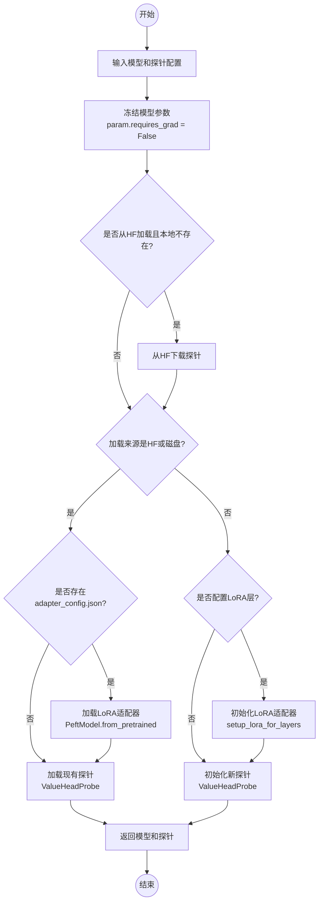

这段代码实现了一个名为`setup_probe`的函数，用于设置和配置一个探针(probe)，主要用于语言模型的微调和评估。

1. 函数目的：

- 为预训练语言模型设置一个探针，用于模型的特定任务评估或微调
- 支持从Hugging Face Hub或本地磁盘加载预训练的探针
- 支持LoRA（Low-Rank Adaptation）适配器的配置和加载

2. 主要功能模块：

a) 模型参数冻结：

```python
for _, param in model.named_parameters():
    param.requires_grad = False
```

- 冻结基础模型的所有参数，防止在训练过程中更新
- 这样做是为了只训练探针部分，而不是进行全模型微调

b) 探针加载逻辑：

- 如果配置为从Hugging Face加载且本地不存在，则下载探针
- 支持从HF或磁盘加载已有探针
- 支持从头创建新的探针

c) LoRA适配器处理：

- 支持加载已存在的LoRA适配器
- 支持为新探针初始化LoRA适配器

3. 使用场景：

- 模型评估：通过探针评估模型的特定能力
- 参数高效微调：使用LoRA进行轻量级模型适配
- 迁移学习：加载预训练的探针用于特定任务

4. 注意事项：

- 使用前需要确保模型是PreTrainedModel类型
- 探针配置必须正确设置
- 使用LoRA时需要正确配置相关参数（lora_r, lora_alpha等）

工作流程图如下：



这个函数是一个重要的工具函数，它提供了灵活的探针配置和加载机制，支持多种使用场景，使得模型评估和微调过程更加便捷和高效。